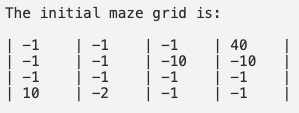
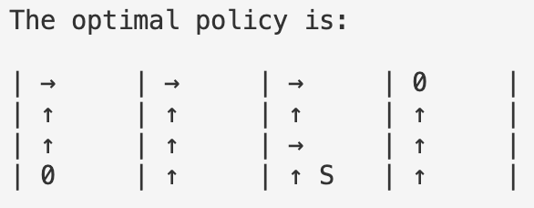

# Adaptive Systems (AS).
## Value Iteration


In de Jupyter Notebook staat alle informatie met betrekking tot de code.

**Returns** = discounted sum(rewards) in one whole episode

**Value function** = expected discounted sum of rewards from certain state

1. Geef de juiste parameters aan.
2. Initialiseer de maze grid met de rewards.
3. Run de functie ***getOptimalPolicy()***.

```python
import numpy as np

GAMMA = 0.9
ROW = 4
COLUMN = 4
ACTIONS = [(1, 0), (0, -1), (-1, 0), (0, 1)]

rewards = [[-1, -1, -1, 40],
           [-1, -1, -10, -10],
           [-1, -1, -1, -1],
           [10, -2, -1, -1]]

policy = getOptimalPolicy(rewards)
```

Je begint met een grid waarvan de rewards erin staan vermeld zoals hieronder:



Na het runnen van de functie hierboven krijg je de optimale policy:



## Monte carlo
Check https://github.com/wolfsinem/as/blob/main/evaluation/initial_monte_carlo.py
